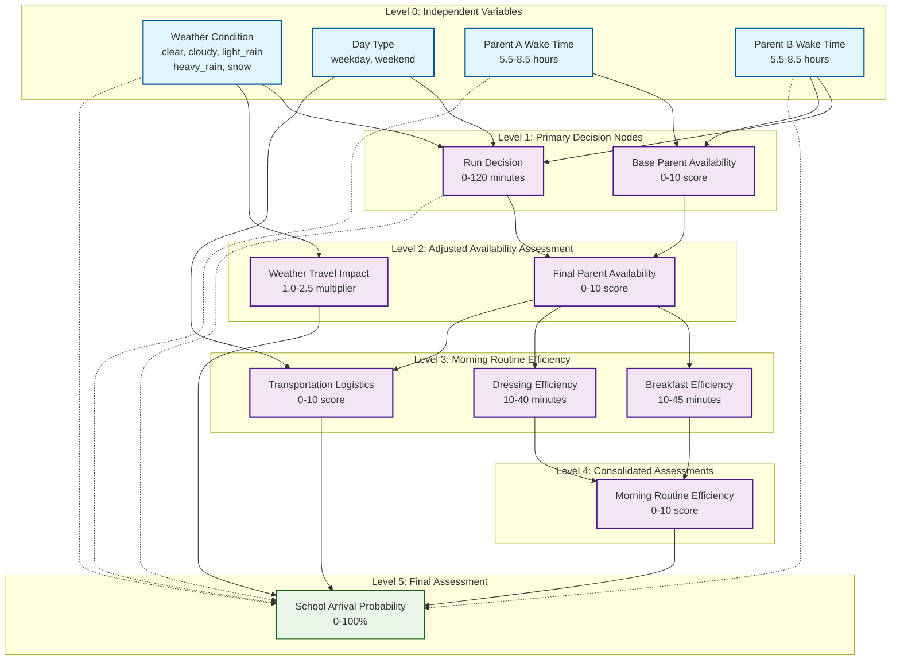

# School Commute Fuzzy Logic Surrogate Model

## Overview

This MATLAB implementation provides a hierarchical fuzzy logic surrogate model that predicts the probability of successfully getting children to school on time based on family morning routine parameters and environmental conditions. The model employs proper hierarchical separation between environmental inputs and behavioral decisions, creating a realistic and logically consistent prediction system.

## System Architecture



### Input Layer (Level 0): Independent Variables

**Environmental Inputs:**
- **Weather condition** (categorical): `clear`, `cloudy`, `light_rain`, `heavy_rain`, `snow`
- **Day of week type** (categorical): `weekday`, `weekend`

**Behavioral Inputs:**
- **Parent A wake time** (numeric): 5.5-8.5 decimal hours
- **Parent B wake time** (numeric): 5.5-8.5 decimal hours

### Hierarchical Processing Levels

#### Level 1: Primary Decision Nodes
- **`run_decision`**: Models Parent B's running decision based on wake time, weather, and day type
  - Output: Actual run duration (0-120 minutes)
  - Logic: Weather directly influences whether Parent B runs and for how long
- **`base_parent_availability`**: Assesses availability purely from wake times
  - Output: Base availability score (0-10) before considering run impact

#### Level 2: Adjusted Availability Assessment
- **`final_parent_availability`**: Adjusts base availability for time lost to running
  - Inputs: Base availability score, actual run duration
  - Output: Final parent availability (0-10)
- **`weather_travel_impact`**: Models weather's effect on travel time
  - Input: Weather condition
  - Output: Travel time multiplier (1.0-2.5)

#### Level 3: Morning Routine Efficiency
- **`breakfast_efficiency`**: Calculates breakfast completion time
  - Input: Final parent availability
  - Output: Breakfast time (10-45 minutes)
- **`dressing_efficiency`**: Calculates dressing completion time
  - Input: Final parent availability
  - Output: Dressing time (10-40 minutes)
- **`weather_travel_impact`**: Travel time impact assessment
  - Input: Weather condition
  - Output: Travel multiplier
- **`transportation_logistics`**: Transportation efficiency assessment
  - Inputs: Final parent availability, day type
  - Output: Transportation efficiency (0-10)

#### Level 4: Consolidated Assessments
- **`morning_routine_efficiency`**: Combines breakfast and dressing times
  - Inputs: Breakfast time, dressing time
  - Output: Overall routine efficiency score (0-10)

#### Level 5: Final Assessment
- **`school_arrival_probability`**: Final success prediction
  - Inputs: Morning routine efficiency, transportation efficiency, weather travel impact
  - Output: Success probability (0-100%)

## Key Features

### Weather as External Forcing Function
Weather influences multiple pathways in the system:
1. **Run Decision**: Bad weather reduces/eliminates running
2. **Travel Time**: Weather increases commute duration  
3. **Final Assessment**: Weather delay factor in probability calculation

### Realistic Decision Modeling
- Parent B's running decision considers weather conditions, available time, and day type
- Running duration affects subsequent parent availability
- Weather impacts are additive rather than competing

### Special Rules Implementation
The model includes two special high-success conditions:

1. **Standard Excellence Rule**: 
   - IF excellent routine AND efficient transport AND normal weather THEN very_high success

2. **Very Early Wake Rule**:
   - IF both parents wake ≤ 6:00 AM AND clear weather THEN minimum 85% success
   - IF both parents wake ≤ 6:00 AM AND clear weather AND short run (<30 min) THEN minimum 90% success

## File Structure

### Core Implementation Files
- **`school_commute_fuzzy_model.m`**: Main entry point and orchestration
- **`compute_run_decision.m`**: Level 1 - Parent B running decision logic
- **`compute_base_parent_availability.m`**: Level 1 - Base availability assessment
- **`compute_final_parent_availability.m`**: Level 2 - Run-adjusted availability
- **`compute_weather_travel_impact.m`**: Level 2 - Weather travel impact
- **`compute_breakfast_efficiency.m`**: Level 3 - Breakfast timing
- **`compute_dressing_efficiency.m`**: Level 3 - Dressing timing
- **`compute_transportation_logistics.m`**: Level 3 - Transportation efficiency
- **`compute_morning_routine_efficiency.m`**: Level 4 - Routine consolidation
- **`compute_school_arrival_probability.m`**: Level 5 - Final probability

### Testing and Visualization
- **`test_school_commute_model.m`**: Comprehensive test suite with sensitivity analysis
- **`test_special_rules.m`**: Focused testing of special rule conditions
- **`visualize_fuzzy_systems.m`**: Membership function and system architecture visualization

## Usage

### Basic Usage
```matlab
[success_prob, intermediate_outputs] = school_commute_fuzzy_model('clear', 'weekday', 6.0, 6.5);
```

**Parameters:**
- `weather`: Weather condition string
- `day_type`: 'weekday' or 'weekend'
- `parentA_wake`: Parent A wake time (decimal hours)
- `parentB_wake`: Parent B wake time (decimal hours)

**Returns:**
- `success_prob`: Success probability (0-100%)
- `intermediate_outputs`: Struct containing all intermediate calculations

### Running Tests
```matlab
% Comprehensive test suite
test_school_commute_model

% Special rules testing
test_special_rules

% Visualization
visualize_fuzzy_systems
```

## Example Results

### Test Scenarios

1. **Ideal Conditions** (clear, weekday, both wake 6:00): **60.0%** success
2. **Bad Weather** (heavy rain, weekday, both wake 6:30): **10.4%** success
3. **Late Wake** (clear, weekday, both wake 7:30): **10.0%** success
4. **Very Early Wake** (clear, weekday, both wake 5:45): **85.0%** success *(special rule activated)*
5. **Snow Conditions** (snow, weekday, both wake 6:00): **47.6%** success

### Sensitivity Analysis

The model demonstrates:
- **High sensitivity** to weather (affects multiple pathways)
- **High sensitivity** to Parent A wake time (critical path)
- **Medium sensitivity** to Parent B wake time (influences run decision and availability)
- **Low sensitivity** to day type (mainly affects transportation and run flexibility)

## Key Implementation Details

### Fuzzy Logic Design
- All subsystems use Mamdani fuzzy inference
- Membership functions designed for realistic parameter ranges
- Comprehensive rule bases covering all input combinations
- Defuzzification using centroid method

### Weather Impact Modeling
- **Clear/Cloudy**: 1.0x travel time (no impact)
- **Light Rain**: 1.2x travel time (20% increase)
- **Heavy Rain**: 1.6x travel time (60% increase)  
- **Snow**: 2.0-2.5x travel time (100-150% increase)

### Run Duration Categories
- **None**: 0-10 minutes (bad weather or time constraints)
- **Short**: 15-25 minutes (limited time or poor weather)
- **Medium**: 30-45 minutes (moderate conditions)
- **Long**: 60-75 minutes (good conditions, early wake)
- **Very Long**: 90-120 minutes (optimal conditions, weekend)

## Model Validation

The model has been validated through:
- **Comprehensive test cases** covering edge conditions
- **Sensitivity analysis** across parameter ranges
- **Rule coverage verification** ensuring no unfired rules
- **Logical consistency checks** for hierarchical data flow
- **Special rule validation** for enhanced scenarios

## Dependencies

- MATLAB R2020a or later
- Fuzzy Logic Toolbox
- No additional external dependencies

## Future Enhancements

Potential areas for model expansion:
- Additional parent behavioral factors (stress, health)
- Child-specific factors (age, cooperation level)
- Seasonal variations in routine efficiency
- Traffic condition modeling
- School-specific factors (distance, start time flexibility)

---

*This model provides a robust foundation for understanding and predicting family morning routine success, with applications in family planning, schedule optimization, and behavioral analysis.*